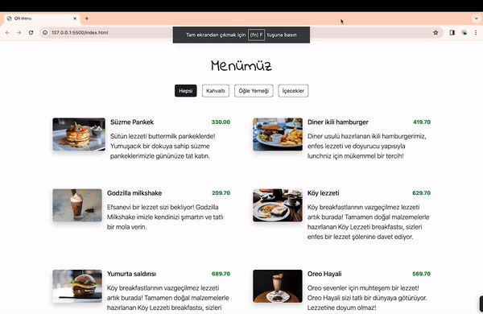

<h1> QRMenü </h1>

This project showcases a dynamic QR menu for restaurants, utilizing the Bootstrap library to enhance visual aesthetics and JavaScript for dynamic functionality.

<h2> The technologies used in the project </h2>

It was coded using Bootstrap and JavaScript technologies.

<h2> Demo </h2>

You can view a live demo of this project [here](https://seliinatmaca.github.io/QRMenu/).

<h2> Screenshot </h2>

